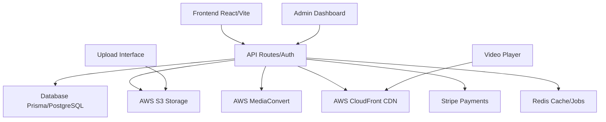

# MentorIA - Plataforma Premium de Mentoria Executiva

Uma plataforma estilo Netflix para conteúdo educacional premium voltado para executivos, CEOs e grandes líderes empresariais.

## 🎯 Visão Geral

O **MentorIA** é uma plataforma de mentoria executiva que oferece:

- **Catálogo Netflix-style**: Interface elegante com navegação intuitiva
- **Conteúdo Premium**: Aulas exclusivas de especialistas renomados
- **RBAC Robusto**: Controle de acesso por roles (master_admin, mentor, mentorado)
- **Gestão de Coortes**: Controle de visibilidade por grupos e planos
- **Player HLS**: Reprodução de vídeo com controle de progresso
- **Dashboard Admin**: Interface completa para gestão de conteúdo

## 🚀 Tecnologias

### Frontend
- **React 18** com TypeScript
- **Vite** para build e desenvolvimento
- **Tailwind CSS** com design system personalizado
- **Radix UI** para componentes acessíveis
- **Lucide React** para ícones

### Funcionalidades Principais

#### 🎥 Catálogo de Vídeos
- Interface tipo Netflix com categorias
- Busca inteligente
- Continuar assistindo
- Favoritos
- Histórico

#### 👥 Sistema de Usuários
- Autenticação por roles
- Perfis de usuário
- Gestão de coortes e planos

#### 📊 Dashboard Administrativo
- Upload e gestão de conteúdo
- Controle de visibilidade
- Analytics básico
- Auditoria de ações

#### 🎮 Player de Vídeo
- Controles personalizados
- Controle de velocidade
- Progresso salvo
- Fullscreen

## 🎨 Design System

### Paleta de Cores
- **Dark Theme**: Background escuro premium
- **Purple/Blue Gradients**: Identidade visual MentorIA
- **Accent Gold**: Destaques e CTAs
- **Status Colors**: Success, Warning, Error

### Componentes
- **VideoCard**: Cards de curso com hover effects
- **CategorySection**: Seções de catálogo rolável
- **HeroSection**: Banner principal com featured content
- **Header**: Navegação com busca e perfil

## 📁 Estrutura do Projeto

```
src/
├── components/          # Componentes React
│   ├── ui/             # Componentes base (shadcn)
│   ├── VideoCard.tsx   # Card de vídeo/curso
│   ├── CategorySection.tsx # Seção de categoria
│   ├── Header.tsx      # Navegação principal
│   ├── HeroSection.tsx # Hero banner
│   ├── VideoPlayer.tsx # Player de vídeo
│   └── AdminDashboard.tsx # Dashboard admin
├── data/               # Dados mock
│   └── mockData.ts     # Cursos e usuários de exemplo
├── types/              # TypeScript types
│   └── index.ts        # Interfaces principais
├── pages/              # Páginas principais
│   ├── Index.tsx       # Homepage/Catálogo
│   └── NotFound.tsx    # Página 404
└── assets/             # Imagens e recursos
    └── hero-mentoria.jpg # Imagem hero gerada
```

## 🛠️ Desenvolvimento

### Comandos Disponíveis

```bash
# Instalar dependências
npm install

# Desenvolvimento local
npm run dev

# Build para produção
npm run build

# Preview do build
npm run preview

# Linting
npm run lint
```

### Variáveis de Ambiente (Futuras)

```env
# AWS Configuration
AWS_ACCESS_KEY_ID=
AWS_SECRET_ACCESS_KEY=
AWS_S3_BUCKET=
AWS_CLOUDFRONT_DOMAIN=

# Database
DATABASE_URL=

# Auth
JWT_SECRET=
AUTH_DOMAIN=

# Stripe
STRIPE_SECRET_KEY=
STRIPE_WEBHOOK_SECRET=
```

## 🎯 Funcionalidades Implementadas

### ✅ Interface Netflix-Style
- [x] Design system dark/premium
- [x] Cards de vídeo com hover effects
- [x] Navegação por categorias
- [x] Hero section responsivo
- [x] Busca em tempo real

### ✅ Sistema de Usuários (Mock)
- [x] Roles simulados (master_admin, mentor, mentorado)
- [x] Perfis de usuário
- [x] Sistema de coortes e planos

### ✅ Player de Vídeo
- [x] Controles customizados
- [x] Progresso de reprodução
- [x] Controle de velocidade
- [x] Fullscreen

### ✅ Dashboard Admin
- [x] Visão geral com métricas
- [x] Gestão de cursos
- [x] Interface de upload
- [x] Controles de publicação

## 🔮 Próximos Passos (Roadmap)

### Backend Integration
- [ ] Autenticação real (Auth.js/Supabase)
- [ ] Database (Prisma + PostgreSQL)
- [ ] Upload para AWS S3
- [ ] Transcodificação HLS (MediaConvert)
- [ ] URLs assinadas

### Funcionalidades Avançadas
- [ ] Analytics detalhado
- [ ] Sistema de comentários
- [ ] Notificações push
- [ ] Webhooks Stripe
- [ ] Auditoria completa

### Performance & Segurança
- [ ] Rate limiting
- [ ] Watermarks em vídeo
- [ ] Anti-sharing detection
- [ ] CDN optimization

## 🏗️ Arquitetura Proposta



## 📈 Métricas de Sucesso

- **Retenção**: % de usuários que completam aulas
- **Engajamento**: Tempo médio assistido por sessão
- **Conversão**: Taxa de upgrade para planos premium
- **Satisfação**: NPS dos mentorands

## 🔒 Segurança

### Implementado (Conceitual)
- RBAC com middleware
- URLs assinadas para vídeos
- Validação client/server-side

### Planejado
- Rate limiting por IP
- Detecção de compartilhamento
- Auditoria de ações críticas
- Backup automático

## 📱 Responsividade

O design é totalmente responsivo com breakpoints:
- **Mobile**: < 768px
- **Tablet**: 768px - 1024px  
- **Desktop**: > 1024px

## 🎨 Customização

### Cores e Temas
Edite `src/index.css` para personalizar:
- Paleta de cores HSL
- Gradients personalizados
- Shadows e effects
- Animações

### Componentes
Todos os componentes seguem o design system e podem ser facilmente customizados via props e variants.

---

**MentorIA** - Transformando liderança através de conteúdo premium e tecnologia de ponta.